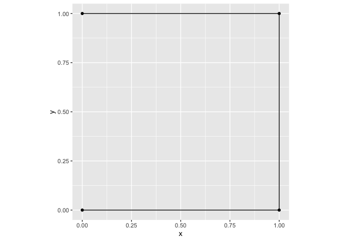

Informazioni iniziali
================
Francesco Invernizzi
2025-04-17

Il documento contiene informazioni di base sulle misure di base usate
per il tracciamento degli animali e calcolate dal pacchetto `amt`.

Creo un `data.frame` con quattro punti e calcolo sia analiticamente che
con il pacchetto `amt` le tre misure di base: step length, turn angle e
direction.

- la “step length” è misurata come [distanza
  euclidea](https://en.wikipedia.org/wiki/Euclidean_distance) tra due
  rilevazioni successive, quindi conserva l’unità di misura dei punti.

- direction e turn angle sono misurati rispettivamente come
  [`atan2`](https://en.wikipedia.org/wiki/Atan2) e differenza tra
  `atan2` consecutivi.

``` r
df <- data.frame(
  x = c(0, 1, 1, 0),
  y = c(0, 0, 1, 1),
  t = as.POSIXct(c("2025-01-01 00:00:00", "2025-01-01 01:00:00",
                 "2025-01-01 02:00:00", "2025-01-01 03:00:00"))
)
# plot:
ggplot(df, aes(x, y)) +
  geom_path() +
  geom_point() +
  coord_equal()
```

<!-- -->

### Calcoli analitici:

1.  **Step length** (distanza euclidea)

``` r
sqrt((1 - 0)^2 + (0 - 0)^2) 
```

    ## [1] 1

``` r
sqrt((1 - 1)^2 + (1 - 0)^2) 
```

    ## [1] 1

``` r
sqrt((0 - 1)^2 + (1 - 1)^2) 
```

    ## [1] 1

2.  **Direction** (`atan2`)

``` r
dir1 = atan2(0, 1)           
dir2 = atan2(1, 0) 
dir3 =atan2(0, -1) 

dir1
```

    ## [1] 0

``` r
dir2
```

    ## [1] 1.570796

``` r
dir3
```

    ## [1] 3.141593

3.  **Turn angle** (differenza tra `atan2` successivi)

``` r
ta_2 = dir2 - dir1 
ta_3 = dir3 - dir2

ta_2
```

    ## [1] 1.570796

``` r
ta_3
```

    ## [1] 1.570796

### Usando il pacchetto `amt`

``` r
trk <- make_track(df, x, y, t) # sistema proiettato (UTM zona 32N)

steps <- trk %>% 
  amt::track_resample(rate = hours(1)) %>% 
  steps_by_burst()

steps %>% dplyr::select(x1_, y1_, x2_, y2_, sl_, direction_p, ta_)
```

    ## # A tibble: 3 × 7
    ##     x1_   y1_   x2_   y2_   sl_ direction_p   ta_
    ## * <dbl> <dbl> <dbl> <dbl> <dbl>       <dbl> <dbl>
    ## 1     0     0     1     0     1        0    NA   
    ## 2     1     0     1     1     1        1.57  1.57
    ## 3     1     1     0     1     1        3.14  1.57
