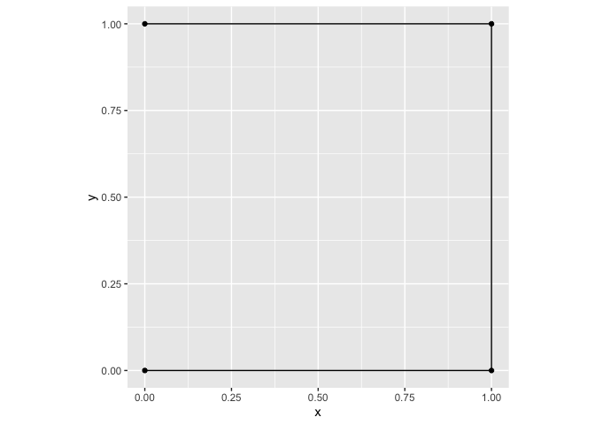
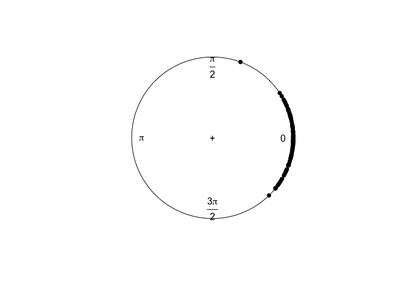

Informazioni iniziali
================
Francesco Invernizzi
2025-05-28

Il documento contiene informazioni di base

# Misure usate per il tracciamento degli animali e calcolate dal pacchetto `amt`

Creo un `data.frame` con quattro punti e calcolo sia analiticamente che
con il pacchetto `amt` le tre misure di base: step length, turn angle e
direction.

- la “step length” è misurata come [distanza
  euclidea](https://en.wikipedia.org/wiki/Euclidean_distance) tra due
  rilevazioni successive, quindi conserva l’unità di misura dei punti.

- direction e turn angle sono misurati rispettivamente come
  [`atan2`](https://en.wikipedia.org/wiki/Atan2) e differenza tra
  `atan2` consecutivi.

``` r
df <- data.frame(
  x = c(0, 1, 1, 0),
  y = c(0, 0, 1, 1),
  t = as.POSIXct(c("2025-01-01 00:00:00", "2025-01-01 01:00:00",
                 "2025-01-01 02:00:00", "2025-01-01 03:00:00"))
)
# plot:
ggplot(df, aes(x, y)) +
  geom_path() +
  geom_point() +
  coord_equal()
```

<!-- -->

### Calcoli analitici:

1.  **Step length** (distanza euclidea)

``` r
sqrt((1 - 0)^2 + (0 - 0)^2) 
```

    ## [1] 1

``` r
sqrt((1 - 1)^2 + (1 - 0)^2) 
```

    ## [1] 1

``` r
sqrt((0 - 1)^2 + (1 - 1)^2) 
```

    ## [1] 1

2.  **Direction** (`atan2`)

``` r
dir1 = atan2(0, 1)           
dir2 = atan2(1, 0) 
dir3 =atan2(0, -1) 
```

``` r
dir1
```

    ## [1] 0

``` r
dir2
```

    ## [1] 1.570796

``` r
dir3
```

    ## [1] 3.141593

3.  **Turn angle** (differenza tra `atan2` successivi)

``` r
ta_2 = dir2 - dir1 
ta_3 = dir3 - dir2
```

``` r
ta_2
```

    ## [1] 1.570796

``` r
ta_3
```

    ## [1] 1.570796

### Usando il pacchetto `amt`

``` r
trk <- make_track(df, x, y, t) # sistema proiettato (UTM zona 32N)

steps <- trk %>% 
  amt::track_resample(rate = hours(1)) %>% 
  steps_by_burst()

steps %>% dplyr::select(x1_, y1_, x2_, y2_, sl_, direction_p, ta_)
```

    ## # A tibble: 3 × 7
    ##     x1_   y1_   x2_   y2_   sl_ direction_p   ta_
    ## * <dbl> <dbl> <dbl> <dbl> <dbl>       <dbl> <dbl>
    ## 1     0     0     1     0     1        0    NA   
    ## 2     1     0     1     1     1        1.57  1.57
    ## 3     1     1     0     1     1        3.14  1.57

# Von Mises distribution

Note basate sul post di [Whittenbury
Daniel](https://dlwhittenbury.github.io/ds-1-sampling-and-visualising-the-von-mises-distribution.html)
riguardanti la distribuzione von Mises.

La “statistica direzionale” ha numerosi usi nelle scienze

- la statistica classica, come sviluppata da Gauss, assume che gli
  errori di misura siano “piccoli” e distribuiti in uno **spazio lineare
  infinito** (come la retta dei numeri reali o uno spazio euclideo)

- questo funziona bene quando le misure sono **molto precise** come nel
  caso di astronomia o dei geometria che usano strumenti accurati

- **le misure angolari** (come direzioni su una bussola, ore del giorno,
  orientamenti spaziali, ecc.) **vivono naturalmente su una struttura
  topologica diversa** (un cerchio o una sfera).

  - Se gli errori diventano grandi (cioè, se i dati sono molto
    dispersi), **non ha più senso ignorare la curvatura** dello spazio
    su cui si trovano i dati.

  - Per esempio, dire che la media tra 10° e 350° è 180° è assurdo in un
    contesto circolare, ma potrebbe sembrare corretto se si ignorasse la
    topologia.

La distribuzione di von Mises è stata introdotta da Richard von Mises
nel 1918 e la sua PDF è
$$ f(x | \mu, \kappa) =  \frac{\exp(k \cos(x - \mu))}{2 \pi I_0(k)} $$

- x è la variabile aleatoria angolare

- $\mu$ è la **direzione media** (con \$

- $\kappa$ è un parametro di concentrazione della distribuzione, che può
  assumere valori non negativi ($\kappa \in [0, \infty)$)

  - più è grande $\kappa$, più la distribuzione è concentrata attorno
    alla direzione media

- $I_0(\kappa)$ è la funzione di Bessel modificata del primo tipo e
  ordine zero

Le distribuzioni circolari hanno diversi vantaggi

- sono definite su uno spazio campionario corretto

  - **la normale può produrre stime errate vicino ai limiti (es. 0 e
    $2\pi$)**

- la distribuzione di von Mises ha un comportamento limite corretto
  quando $\kappa \to 0$: tende a una distribuzione uniforme sul cerchio
  dove tutte le direzioni sono equiprobabili

- **usare la normale in problemi circolari può portare a errori seri
  come fondere in modo scorretto una distribuzione a priori con una
  funzione di verosimiglianza**

  - **nelle misurazioni dell’angolo di arrivo (in applicazioni di
    tracciamento), si rischia di aggiornare male la stima bayesiana se
    si ignora la natura ciclica della variabile**

# Optim function

A common task in statistics is maximizing (or minimizing) complex
univariate or multivariate functions. This is typically done in the
context of maximizing likelihood functions with respect to a vector of
unknown parameters, given the observed data.

- More generally, this task pertains to an “optimization” problem, where
  we seek to finding a set of parameter values that minimizes or
  maximizes some pre-defined objective function.

- When this objective function is a log likelihood function, this
  reduces to the problem of maximum likelihood estimation.

- There are many potential approaches to use for optimization in this
  context.

- How best to optimize a function of interest depends on the nature of
  the function to be optimized, as well as practical concerns regarding
  a candidate procedure to be used.

By default `optim` performs minimization, but it will maximize if
control\$fnscale is negative. optimHess is an auxiliary function to
compute the Hessian at a later stage if hessian = TRUE was forgotten.

- The default method is an implementation of that of Nelder and Mead
  (1965), that uses only function values and is robust but relatively
  slow. It will work reasonably well for non-differentiable functions.

- Method “BFGS” is a quasi-Newton method (also known as a variable
  metric algorithm), specifically that published simultaneously in 1970
  by Broyden, Fletcher, Goldfarb and Shanno. This uses function values
  and gradients to build up a picture of the surface to be optimized.

- Method “CG” is a conjugate gradients method based on that by Fletcher
  and Reeves (1964) (but with the option of Polak–Ribiere or
  Beale–Sorenson updates). Conjugate gradient methods will generally be
  more fragile than the BFGS method, but as they do not store a matrix
  they may be successful in much larger optimization problems.

- Method “L-BFGS-B” is that of Byrd et al. (1995) which allows box
  constraints, that is each variable can be given a lower and/or upper
  bound. The initial value must satisfy the constraints. This uses a
  limited-memory modification of the BFGS quasi-Newton method. If
  non-trivial bounds are supplied, this method will be selected, with a
  warning.

- Nocedal and Wright (1999) is a comprehensive reference for the
  previous three methods.

- Method “SANN” is by default a variant of simulated annealing given in
  Belisle (1992).

  - Simulated-annealing belongs to the class of stochastic global
    optimization methods. It uses only function values but is relatively
    slow.

  - It will also work for non-differentiable functions. This
    implementation uses the Metropolis function for the acceptance
    probability.

  - By default the next candidate point is generated from a Gaussian
    Markov kernel with scale proportional to the actual temperature. If
    a function to generate a new candidate point is given, method “SANN”
    can also be used to solve combinatorial optimization problems.

  - Temperatures are decreased according to the logarithmic cooling
    schedule as given in Belisle (1992, p. 890); specifically, the
    temperature is set to
    `temp / log(((t-1) %/% tmax) * tmax + exp(1))`, where `t` is the
    current iteration step and `temp` and `tmax` are specifiable via
    control, see below.

  - Note that the “SANN” method depends critically on the settings of
    the control parameters. It is not a general-purpose method but can
    be very useful in getting to a good value on a very rough surface.

- Method “Brent” is for one-dimensional problems only, using
  `optimize(<ff>, lower, upper, tol = control$reltol)` where `<ff>` is
  `function(par) fn(par, ...)/control$fnscale`. It can be useful in
  cases when `optim()` is used inside other functions where only method
  can be specified, such as in `mle` from package stats4.

Function `fn` can return `NA` or `Inf` if the function cannot be
evaluated at the supplied value, but the initial value must have a
computable finite value of fn. (Except for method “L-BFGS-B” where the
values should always be finite.)

`optim` can be used recursively, and for a single parameter as well as
many. It also accepts a zero-length par, and just evaluates the function
with that argument.

### Esempio Normale

``` r
lik <- function(par, y, x) {
  y = y 
  x = x
  beta0 <- par[1] 
  beta1 <- par[2]
  
  lik <- sum(dnorm(y, mean = (beta0 + beta1*x), sd = sd(y), log = T))
  return(-lik)
}

data("iris")

lm(iris$Petal.Length ~ iris$Petal.Width)
```

    ## 
    ## Call:
    ## lm(formula = iris$Petal.Length ~ iris$Petal.Width)
    ## 
    ## Coefficients:
    ##      (Intercept)  iris$Petal.Width  
    ##            1.084             2.230

``` r
optim(
  par = c(0,0),
  fn = lik,
  y = iris$Petal.Length,
  x = iris$Petal.Width
)
```

    ## $par
    ## [1] 1.083674 2.230101
    ## 
    ## $value
    ## [1] 228.519
    ## 
    ## $counts
    ## function gradient 
    ##      113       NA 
    ## 
    ## $convergence
    ## [1] 0
    ## 
    ## $message
    ## NULL

### Stima dei parametri della Von Mises

Siano $X_1, \dots, X_n$ `n` v.a. iid, con $X_i \sim$ VonMises($\mu, k$)

1.  Definisco la funzione di log-verosimiglianza delle $n$ v.a. come
    sommatoria delle singole log-verosimiglianze in virtù dell’ipotesi
    i.i.d.

``` r
log_lik_vm <- function(data, par){
  log_lik <- sum(circular::dvonmises(data, mu = par[1], kappa = par[2], log = T))
  return(log_lik)
}
```

2.  Estraggo un campione casuale dalla popolazione VM($0, 10$)

``` r
data_rndm <- circular::rvonmises(n = 100, mu = 0, kappa = 10)
circular::plot.circular(data_rndm)
```

<!-- -->

3.  Massimizzo la funzione di log-verosimiglianza (e controllo i
    risultati con mle.vonmises)

``` r
optim(
  par = c(0,0),
  fn = log_lik_vm,
  data = data_rndm,
  control = list(fnscale = -1)
)
```

    ## $par
    ## [1] -0.02918066  9.87865086
    ## 
    ## $value
    ## [1] -30.13553
    ## 
    ## $counts
    ## function gradient 
    ##       93       NA 
    ## 
    ## $convergence
    ## [1] 0
    ## 
    ## $message
    ## NULL

``` r
circular::mle.vonmises(data_rndm, mu=NULL, kappa=NULL, bias=FALSE, control.circular=list())
```

    ## 
    ## Call:
    ## circular::mle.vonmises(x = data_rndm, mu = NULL, kappa = NULL,     bias = FALSE, control.circular = list())
    ## 
    ## mu: -0.02919  ( 0.03268 )
    ## 
    ## kappa: 9.876  ( 1.356 )

### Stima di una Von Mises con una covariata

1.  Creo due vettori $\mathbf{x}_n$ e $\mathbf{y}_n$ in cui

- $X_i \sim N(0, 1)$

- $Y_i \sim VonMises(\mu = 2atan(\beta_0 +\beta_1 \cdot x_i), k = (10))$

``` r
rndm_x <- rnorm(100)
rndm_y <- array()
#
for(i in seq_along(rndm_x)) {
  rndm_y[i] = circular::rvonmises(n = 1, mu = 2*atan(-1 + 3.5 * rndm_x[i]), kappa = 10)
}
```

2.  Definisco la funzione di log-verosimiglianza

    - versione 1: pacchetto circular

``` r
log.lik.vm <- function(x, y, par){
  
  beta.0 <- par[1]
  beta.1 <- par[2]
  kappa.log <- exp(par[3])
  
  l <- array(dim=length(x))

  for (i in seq_along(x)) {
    l[i] = circular::dvonmises(y[i], mu = 2 * atan(beta.0 + beta.1 * x[i]), kappa = kappa.log, log = T)
  }

  log.lik <- sum(l)

  return(-log.lik)
}
```

     - versione 2: formula 

``` r
log.lik.vm.manual <- function(par, x, y){
  
  beta.0 <- par[1]
  beta.1 <- par[2]
  kappa.log <- exp(par[3])
  
  l <- array(dim = length(x))
  
  for(i in seq_along(x)){
    l[i] = kappa.log * cos(y[i] - 2 * atan(beta.0 + beta.1*x[i])) - log((besselI(kappa.log, nu = 0)))
    }

  log.lik <- sum(l)
  return(-log.lik)
  }
```

3.  minimizzo la - log-verosimiglianza

``` r
optim(
  par = c(log(1), 0, 0),
  fn = log.lik.vm,
  x = rndm_x,
  y = rndm_y)
```

    ## $par
    ## [1] -1.133755  3.717465  2.355218
    ## 
    ## $value
    ## [1] 26.68529
    ## 
    ## $counts
    ## function gradient 
    ##      144       NA 
    ## 
    ## $convergence
    ## [1] 0
    ## 
    ## $message
    ## NULL

``` r
optim(
   par = c(log(1), 0, 0),
   fn = log.lik.vm.manual,
   x = rndm_x,
   y = rndm_y)
```

    ## $par
    ## [1] -1.133729  3.717195  2.355412
    ## 
    ## $value
    ## [1] -157.1024
    ## 
    ## $counts
    ## function gradient 
    ##      156       NA 
    ## 
    ## $convergence
    ## [1] 0
    ## 
    ## $message
    ## NULL

### Simulazione di $K$ repliche per lo stesso set di parametri veri

Definisco una funzione che dati

- `n` = la numerosità del campione casuale

- `K` = il numero di repliche

- `beta.0` e `beta.1` = il valore reale dei parametri

- `kappa` = il valore reale del parametro di concentrazione della Von
  Mises

Genera $K$ set di random $x$ e random $y$ e stima i parametri
ottimizzando la funzione di verosimiglianza per ogni set. La funzione
restituisce una tabella in cui le colonne rappresentano i valori stimati
dei parametri e le righe sono le $K$ simulazioni

``` r
simulation <- function(n, K, beta.0, beta.1, kappa){
#  1. Genero un dataframe di valori casuali
  
  # Matrix of K column and n random normal values per column
  x.matrix <- matrix(nrow = n, ncol = K)
  for (k in 1:K) {
    x.matrix[,k] <- rnorm(n)
  }
  
  # Matrix of K column and n random values extracted from Von Mises distribution with mu = (beta.0 + beta.1 * x.matrix[r,k]) and kappa = kappa
  y.matrix <- matrix(nrow = n, ncol = K)
  for (k in 1:K) {
    for (r in 1:n) {
      y.matrix[r,k] <- circular::rvonmises(n= 1, mu=(beta.0 + beta.1 * x.matrix[r,k]), kappa = kappa)
    }
  }
  
  # a tibble with x1, x2, ..., xn and y1, y2, ..., yn columns
  xy.tibble <- tibble(
    !!!set_names(as.data.frame(x.matrix), paste0("x", 1:K)),
    !!!set_names(as.data.frame(y.matrix), paste0("y", 1:K))
  )

# 2. funzione di log-verosimiglianza da massimizzare
  log.lik.vm <- function(par, x, y){
    
    beta.0 <- par[1]
    beta.1 <- par[2]
    kappa.log <- exp(par[3])
    
    l <- array(dim = length(x))
    
    for(i in seq_along(x)){
      l[i] = kappa.log * cos(y[i] - 2 * atan(beta.0 + beta.1*x[i])) - log((besselI(kappa.log, nu = 0)))
    }
    
    log.lik <- sum(l)
    return(-log.lik)
  }

#3. ottimizzazione della funzione 
   # matrice per registrare i risultati
   results <- matrix(nrow = K, ncol = 3)
    
    # ottimizzazione per ogni set di dati
    for (k in 1:K) {
      opt <- optim(
        par = c(log(1), 0, 0), 
        fn = log.lik.vm, 
        x = xy.tibble %>% pull(paste0("x", k)),
        y = xy.tibble %>% pull(paste0("y", k))
      )
      
      results[k, ] <- opt$par
    }
   colnames(results) <- c("beta.0", "beta.1", "log.kappa")
   rownames(results) <- paste0("set_", 1:K)
   
    return(results)
  }

simulation(10, 10, -1, 3.5, 10)
```

    ##            beta.0      beta.1   log.kappa
    ## set_1   3.9274834  2.62801737  0.28131635
    ## set_2  -1.7967506  0.99574405  0.20329998
    ## set_3  -0.6860335  3.50338410  0.37467749
    ## set_4  -1.5465375  3.58118908  0.13119734
    ## set_5   3.7209348 -2.81528305 -0.36512723
    ## set_6   0.9996214  0.08298794 -0.06988218
    ## set_7  16.8484829 13.49221124 -0.65943546
    ## set_8  -0.6843389  3.65389243  1.03560167
    ## set_9   1.6086572 -1.91684622 -0.60748474
    ## set_10 -2.6666810  6.04313567  1.03556194
