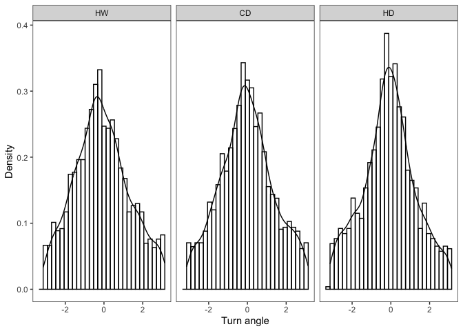
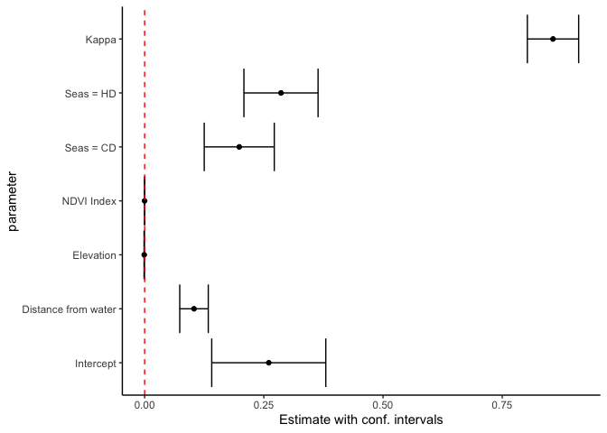
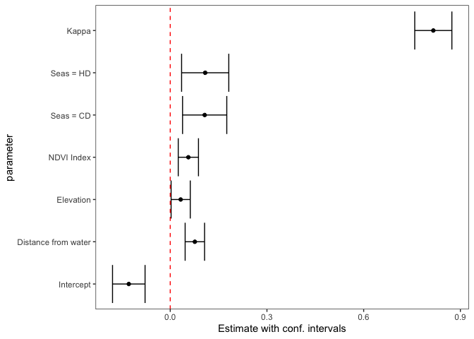
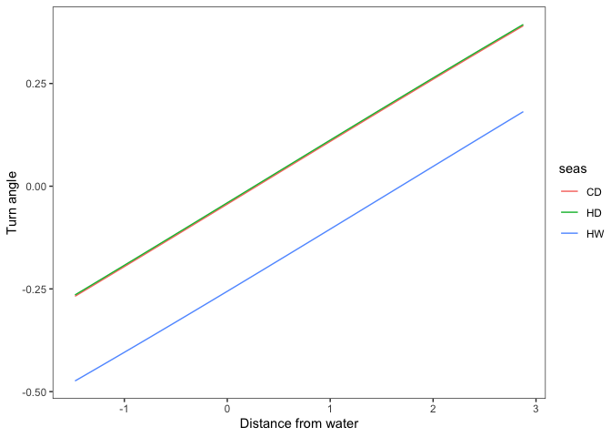
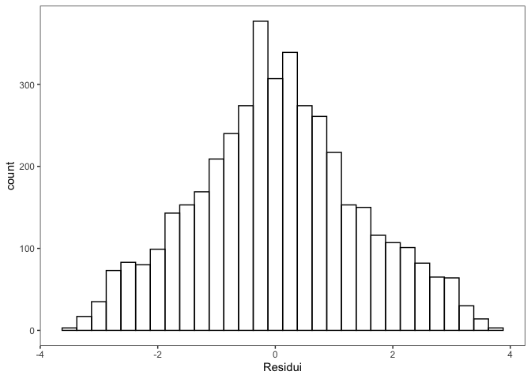

Analisi del primo elefante (id: GON09)
================
Francesco Invernizzi
2025-07-03

Usando il pacchetto `amt` e seguendo i passaggi svolti nel [paper di
riferimento del pacchetto](https://doi.org/10.1002/ece3.4823) svolgo le
analisi sul primo elefante del `df`.

## Preparazione dei dati

Le principali funzioni per la preparazione dei dati sono le seguenti:

- `amt::make_track()` crea un “track” cioè una tibble contenente le
  coordinate x e y, il tempo (t) e un sistema di riferimento di
  coordinate (CRS). Questa tibble verrà utilizzata dal pacchetto per le
  operazioni successive. Nel nostro caso il CRS è identificato con
  EPSG:21036, Arc 1960, UTM zone 36S.

``` r
load(paste0(dir_data, "/data_elephants_clean_envcovs.RData"))
GON09 <- data_elephants %>% #ordino i dati per id e data/ora
  arrange(id, timepoint) %>% 
  filter(id == "GON09")

crs <- capture.output(st_crs(GON09))
cat(crs[1:2], sep = "\n")
```

    ## Coordinate Reference System:
    ##   User input: +proj=utm +zone=36 +datum=WGS84 +units=km

- `amt::summarize_sampling_rate()` fornisce la distribuzione della
  frequenza di campionamento e consente di vedere se le registrazione
  della posizione sono state costanti e con che intervallo.

``` r
GON09_trk <- amt::make_track(GON09,
                             .x = "XUTM",
                             .y = "YUTM", 
                             .t = "timepoint",
                             crs = 21036) 

amt::summarize_sampling_rate(GON09_trk)
```

    ## # A tibble: 1 × 9
    ##        min    q1 median  mean    q3   max    sd     n unit 
    ##      <dbl> <dbl>  <dbl> <dbl> <dbl> <dbl> <dbl> <int> <chr>
    ## 1 0.000278  3.99   4.00  4.22  4.01  296.  4.76  4831 hour

- `amt::track_resample()` unito a `filter_min_n_burst(3)` permettono di
  conservare le osservazioni solo nel caso in cui in cui le
  registrazioni della posizione avvengono ad un intervallo costante (nel
  nostro caso 4h $pm$ 15 min) per almeno tre registrazioni consecutive

- `steps_by_burst()` passa da un `df` in cui ogni riga corrisponde ad
  una posizione ad uno in cui ogni riga corrisponde ad un passo. Per
  ogni passo, sono incluse le variabili coordinate di inizio (x1\_, y1\_
  ), cordinate finali (x2\_, y2\_ ), tempo di inizio e di fine (t1\_,
  t2\_ ), step length (sl\_; in CRS units), turning angles (ta\_; in
  degrees), la time difference (dt\_ ) e la burst (sequenza di passi con
  intervallo di registrazione di 4h) (burst\_ ) a cui appartiene il
  passo

``` r
GON09_trk <-  track_resample(GON09_trk,
                             rate = hours(4), 
                             tolerance = minutes(20)) %>% 
  filter_min_n_burst(3) %>% 
  steps_by_burst() 

knitr::kable(head(GON09_trk, 15), format = "markdown", digits = 2)
```

| burst\_ | x1\_ | x2\_ | y1\_ | y2\_ | sl\_ | direction_p | ta\_ | t1\_ | t2\_ | dt\_ |
|---:|---:|---:|---:|---:|---:|---:|---:|:---|:---|:---|
| 3 | 414.44 | 414.83 | -2338.37 | -2338.32 | 0.39 | 0.14 | NA | 2016-02-02 01:58:49 | 2016-02-02 05:57:46 | 3.98 hours |
| 3 | 414.83 | 414.83 | -2338.32 | -2339.04 | 0.72 | -1.58 | -1.72 | 2016-02-02 05:57:46 | 2016-02-02 09:57:57 | 4.00 hours |
| 3 | 414.83 | 416.14 | -2339.04 | -2339.60 | 1.43 | -0.41 | 1.17 | 2016-02-02 09:57:57 | 2016-02-02 13:57:52 | 4.00 hours |
| 5 | 415.06 | 414.39 | -2340.00 | -2339.49 | 0.84 | 2.49 | NA | 2016-02-03 13:57:54 | 2016-02-03 17:58:00 | 4.00 hours |
| 5 | 414.39 | 413.71 | -2339.49 | -2338.76 | 1.00 | 2.32 | -0.17 | 2016-02-03 17:58:00 | 2016-02-03 21:58:02 | 4.00 hours |
| 5 | 413.71 | 414.15 | -2338.76 | -2338.21 | 0.70 | 0.90 | -1.42 | 2016-02-03 21:58:02 | 2016-02-04 01:58:02 | 4.00 hours |
| 5 | 414.15 | 415.03 | -2338.21 | -2337.89 | 0.94 | 0.36 | -0.54 | 2016-02-04 01:58:02 | 2016-02-04 05:57:59 | 4.00 hours |
| 5 | 415.03 | 415.18 | -2337.89 | -2338.44 | 0.58 | -1.29 | -1.65 | 2016-02-04 05:57:59 | 2016-02-04 09:58:05 | 4.00 hours |
| 5 | 415.18 | 413.26 | -2338.44 | -2340.91 | 3.13 | -2.23 | -0.94 | 2016-02-04 09:58:05 | 2016-02-04 13:58:10 | 4.00 hours |
| 5 | 413.26 | 412.03 | -2340.91 | -2341.73 | 1.48 | -2.55 | -0.32 | 2016-02-04 13:58:10 | 2016-02-04 17:58:13 | 4.00 hours |
| 5 | 412.03 | 410.50 | -2341.73 | -2343.37 | 2.24 | -2.32 | 0.23 | 2016-02-04 17:58:13 | 2016-02-04 21:58:07 | 4.00 hours |
| 5 | 410.50 | 410.27 | -2343.37 | -2343.08 | 0.38 | 2.24 | -1.73 | 2016-02-04 21:58:07 | 2016-02-05 01:58:16 | 4.00 hours |
| 5 | 410.27 | 410.52 | -2343.08 | -2342.77 | 0.40 | 0.90 | -1.34 | 2016-02-05 01:58:16 | 2016-02-05 05:58:04 | 4.00 hours |
| 5 | 410.52 | 411.15 | -2342.77 | -2342.62 | 0.65 | 0.22 | -0.68 | 2016-02-05 05:58:04 | 2016-02-05 10:00:56 | 4.05 hours |
| 8 | 414.42 | 413.38 | -2340.33 | -2338.81 | 1.83 | 2.17 | NA | 2016-02-06 17:58:25 | 2016-02-06 21:58:27 | 4.00 hours |

- `amt::extract_covariates` consente di estrarre delle covariate
  ambientali da un raster. Dato che il dataset originale associa già
  alla posizione la distanza dalla riva (distriv), l’indive NDVI (ndvi),
  l’elevazione (elev) e la stagione (seas) ad ogni posizione, uso
  `left_join` per associare le covariate alla posizione di arrivo. Come
  specificato dal paer questa è una prima scelta:

> Depending on the target process under investigation (habitat selection
> or movement), covariates might be extracted at the end of the step
> (habitat selection process) or at the start of the step (movement
> process). If covariates are extracted at the end of the step, they are
> typically included in the model as main effects, to answer questions
> of the type: How do covariates influence where the animal moves? In
> contrary, if covariates are extracted at the beginning of the step,
> they are typically included in the model as an interaction with
> movement characteristics (step length, log of the step length, or the
> cosine of the turn angle), to test hypotheses of the type: Do animals
> move faster/more directed, if they start in a given habitat? Finally,
> covariate values at the start and the end of a step can also be
> included in the model as an interaction with each other, to test
> hypotheses of the type: Are animals more likely to stay in a given
> habitat, if they are already in that habitat?

``` r
GON09_fnl <- GON09_trk %>% 
  left_join(
    dplyr::select(GON09, XUTM, YUTM, distriv, ndvi, elev, seas),
    join_by("x2_" == "XUTM", "y2_" == "YUTM")
  )
```

## Analisi esplorativa dei dati

Gli istogrammi rappresentano le distribuzioni di step length, turn angle
e direction nelle tre stagioni climatiche

> Three climatic seasons can be recognised in the Gonarezhou landscape,
> the hot wet (HW) season (November to March, when 90% of annual rain
> falls); the cool dry (CD) season (April to August); and the hot dry
> (HD) season (September to October) (Gandiwa 2014; Republic of Zimbabwe
> 2016).

``` r
ggplot(data = GON09_fnl, aes(x = sl_, y = ..density..)) +
  geom_histogram(color = "black", fill = NA) +
  geom_density() +
  facet_wrap(~ seas) +
  theme_test() +
  xlab("Step length [km]") +
  ylab("Density")
```


``` r
ggplot(data = GON09_fnl, aes(x = ta_, y = ..density..)) +
  geom_histogram(color = "black", fill = NA) +
  geom_density() +
  facet_wrap(~ seas) +
  theme_test() +
  xlab("Turn angle") +
  ylab("Density")
```



``` r
ggplot(data = GON09_fnl, aes(x = direction_p, y = ..density..)) +
  geom_histogram(color = "black", fill = NA) +
  geom_density() +
  facet_wrap(~ seas) +
  theme_test() +
  xlab("Direction") +
  ylab("Density")
```


## Modello

Nel paper, come riporto qua sotto, viene utilizzato il metodo iSSFs. La
variabile dipendente è la step length mentre il turn angle viene usato
per stimare le step length random di controllo.

> To fit SSFs, the observed covariates associated with observed steps
> are compared to covariates associated with random (or control) steps.
> Random steps can be generated by either (a) sampling from the observed
> turn step‐length and turn angle distribution (resulting in a
> traditional SSF), or (b) by fitting a parametric distribution to the
> observed step lengths (either a negative‐exponential, a halfnormal, a
> log‐normal, or a gamma; see Avgar et al., 2016, Appendix 2) and turn
> angles (a von Mises; Duchesne et al., 2015). As mentioned above, an
> iSSF is arguably less biased and also provides the user with a
> mechanistic movement model that can be used to simulate space use, and
> hence utilization distributions (Avgar et al., 2016; Signer et al.,
> 2017). Currently, amt only implements the iSSFs with gamma and von
> Mises distributions. Thus, we proceed by fitting a gamma distribution
> to the step lengths and a von Mises distribution to the turn angles
> using maximum likelihood (Agostinelli & Lund, 2017; Delignette‐Muller
> & Dutang, 2015), and use these distributions to generate and pair nine
> random steps with each observed step. The number of random steps
> effects the estimation error; the more the steps, the lower the error,
> but the higher the computational burden (Avgar et al., 2016). We then
> extract the covariates at the end point of each step (observed and
> random) using the function amt::extract\_ covariates, and fit a
> conditional logistic regression model to the resulting data including
> movement‐related covariates with the function amt::fit_issf (a wrapper
> to survival::clogit; Therneau & Grambsch, 2000; see Supporting
> information Data S2 for details of the model). The target variable
> case\_ is one for observed steps and zero for random (or control)
> steps. Each step is paired with several (here 9) control steps that
> form together a stratum (indicated by strat(step *id*) in the model
> formula). The function amt::random \_steps automatically creates a new
> column, step *id* , that identifies different strata

In questo caso vogliamo verificare se il Turn angle sia influenzato
dalle variabili a disposizione, cioè la distanza dalla riva `distriv`,
l’altitudine `elev`, l’indice `ndvi` e la stagione `seas`.

- Definisco la funzione di verosimiglianza assumendo

$$
\mu_i = 2 \cdot \arctan(\mathbf{x}_i^\top \boldsymbol{\beta}) = 2 \cdot \arctan(\eta_i)
$$

dove:

- $\mathbf{x}_i = (1, \text{distriv}_i, \text{elev}_i, \text{ndvi}_i, \text{seas}_i)$
- $\boldsymbol{\beta} = (\beta_0, \beta_1, \dots, \beta_k)$
- $\kappa = \exp(\theta)$, per garantire $\kappa > 0$

Assumiamo per il turn angle (`ta`) il seguente modello:

$$
y_i \propto \beta_0 + \beta_1 \cdot \text{distriv}_i + \beta_2 \cdot \text{elev}_i + 
\beta_3 \cdot \text{ndvi}_i + \beta_4 \cdot \text{seasCD}_i + \beta_5 \cdot \text{seasHD}_i
$$

dove la variabile `seas` è trattata come fattore con base la stagione
“HW”

``` r
log.lik.VM <- function(par, data, formula, response){
  # Dati
  X <- model.matrix(formula, data = data)
  y <- data[[response]]
  
  # Parametri
  p <- ncol(X)
  beta <- par[1:p]
  kappa <- exp(par[p+1])
  
  # 2. Elimina righe con NA
  valid <- complete.cases(y, X)
  y <- y[valid]
  X <- X[valid, , drop = FALSE]
  
  # Link function
  eta <- X %*% beta
  mu <- 2 * atan(eta)
  
  # Log-likelihood function
  l <- kappa * cos(y - mu) - log(besselI(kappa, nu = 0))
  return(-sum(l))
}

fit <- optim(
  par = c(rep(0,6), log(2)),
  fn = log.lik.VM, 
  data = GON09_fnl, 
  formula = ~ distriv + elev + ndvi + seas, 
  response = "ta_",
  hessian = T
)

# Risultati
tibble(
  parametri = factor(c("Intercept", "Distance from water", "Elevation", "NDVI Index",
                       "Seas = CD", "Seas = HD", "Kappa"),
                     levels = c("Intercept", "Distance from water", "Elevation", "NDVI Index",
                                "Seas = CD", "Seas = HD", "Kappa")),
  estimate = c(fit$par[1:6], exp(fit$par[7])), 
  se = sqrt(diag(solve(fit$hessian))),
  lower = estimate - qnorm(0.975) * se,
  upper = estimate + qnorm(0.975) * se
) %>%
  mutate(across(where(is.numeric), ~ round(.x, 4))) %>%
  kable(
    col.names = c("Parameter", "Estimate", "Std. Error", "95% CI Lower", "95% CI Upper"),
    align = "lcccc",
    format = "markdown"
  )
```

| Parameter           | Estimate | Std. Error | 95% CI Lower | 95% CI Upper |
|:--------------------|:--------:|:----------:|:------------:|:------------:|
| Intercept           |  0.2603  |   0.0610   |    0.1407    |    0.3799    |
| Distance from water |  0.1035  |   0.0153   |    0.0736    |    0.1335    |
| Elevation           | -0.0008  |   0.0002   |   -0.0012    |   -0.0005    |
| NDVI Index          | -0.0001  |   0.0000   |   -0.0001    |    0.0000    |
| Seas = CD           |  0.1984  |   0.0375   |    0.1250    |    0.2719    |
| Seas = HD           |  0.2860  |   0.0397   |    0.2082    |    0.3637    |
| Kappa               |  0.8564  |   0.0275   |    0.8026    |    0.9102    |

``` r
tibble(
  parameter = factor(c("Intercept", "Distance from water", "Elevation", "NDVI Index",
                       "Seas = CD", "Seas = HD", "Kappa"),
                     levels = c("Intercept", "Distance from water", "Elevation", "NDVI Index",
                                "Seas = CD", "Seas = HD", "Kappa")),
  estimate = c(fit$par[1:6], exp(fit$par[7])), 
  se = sqrt(diag(solve(fit$hessian))),
  lower = estimate - qnorm(0.975) * se,
  upper = estimate + qnorm(0.975) * se
) %>%
  ggplot(aes(estimate, parameter)) +
  geom_point() +
  geom_errorbarh(aes(xmin = lower, xmax = upper)) +
  geom_vline(xintercept = 0, lty = 2, color = "red") +
  labs(
    x = "Estimate with conf. intervals"
  ) +
  theme_classic()
```



### Regressione con variabili standardizzate

[Link](https://www.statlect.com/fundamentals-of-statistics/linear-regression-with-standardized-variables)
su cui ho approfondito

- Standardizziamo le covariate prima di includerle nella regressione
- Ci aspetteremmo un coefficiente pari a 0 per l’intercetta: si potrebbe
  anche escludere dalla regressione, ma per uniformità del codice lo
  includo.
- I coefficienti standardizzati sono di più facile interpretazione e
  possono essere confrontati tra di loro
  - In una regressione standardizzata un incremento unitario corrisponde
    ad uno scostamento di una deviazione standard dalla media
  - In questo caso l’interpretazione non dovrebbe essere così lineare
    perché i coefficienti passano attraverso la funzione link

``` r
GON09_fnl <- GON09_fnl %>% 
  mutate("distriv_std" = scale(GON09_fnl$distriv)[,1],
         "elev_std" = scale(GON09_fnl$elev)[,1],
         "ndvi_std" = scale(GON09_fnl$ndvi)[,1])

fit_std <- optim(
  par = c(rep(0,6), log(2)),
  fn = log.lik.VM, 
  data = GON09_fnl, 
  formula = ~ distriv_std + elev_std + ndvi_std + seas, 
  response = "ta_",
  hessian = T
)

tibble(
  parametri = c("Intercept", "Distance from water", "Elevation", "NDVI Index", "Seas = CD", "Seas = HD", "Kappa"),
  estimate = c(fit_std$par[1:6], exp(fit_std$par[7])), 
  se = sqrt(diag(solve(fit_std$hessian))),
  lower = estimate - qnorm(0.975) * se,
  upper = estimate + qnorm(0.975) * se
) %>% 
  mutate(across(where(is.numeric), ~ round(.x, 4))) %>%
  kable(
    col.names = c("Parameter", "Estimate", "Std. Error", "95% CI Lower", "95% CI Upper"),
    align = "lcccc",
    format = "markdown"
  )
```

| Parameter           | Estimate | Std. Error | 95% CI Lower | 95% CI Upper |
|:--------------------|:--------:|:----------:|:------------:|:------------:|
| Intercept           | -0.1286  |   0.0258   |   -0.1791    |   -0.0781    |
| Distance from water |  0.0763  |   0.0154   |    0.0462    |    0.1065    |
| Elevation           |  0.0324  |   0.0152   |    0.0027    |    0.0621    |
| NDVI Index          |  0.0562  |   0.0160   |    0.0248    |    0.0876    |
| Seas = CD           |  0.1068  |   0.0350   |    0.0382    |    0.1754    |
| Seas = HD           |  0.1084  |   0.0373   |    0.0352    |    0.1816    |
| Kappa               |  0.8160  |   0.0294   |    0.7584    |    0.8736    |

``` r
tibble(
  parameter = factor(c("Intercept", "Distance from water", "Elevation", "NDVI Index",
                       "Seas = CD", "Seas = HD", "Kappa"),
                     levels = c("Intercept", "Distance from water", "Elevation", "NDVI Index",
                                "Seas = CD", "Seas = HD", "Kappa")),
  estimate = c(fit_std$par[1:6], exp(fit_std$par[7])), 
  se = sqrt(diag(solve(fit_std$hessian))),
  lower = estimate - qnorm(0.975) * se,
  upper = estimate + qnorm(0.975) * se
) %>%
  ggplot(aes(estimate, parameter)) +
  geom_point() +
  geom_errorbarh(aes(xmin = lower, xmax = upper)) +
  geom_vline(xintercept = 0, lty = 2, color = "red") +
  labs(
    x = "Estimate with conf. intervals"
  ) +
  theme_test()
```



``` r
expand_grid(
    distriv_seq = seq(
      from = min(GON09_fnl$distriv_std, na.rm = T),
      to = max(GON09_fnl$distriv_std, na.rm = T),
      length.out = 100
    ),
    seas = c("HW", "CD", "HD")) %>% 
  mutate(
    seasCD = as.numeric(seas == "CD"),
    seasHD = as.numeric(seas == "HD"),
    mu = 2 * atan(fit_std$par[1] + distriv_seq * fit_std$par[2] + seasCD * fit_std$par[5] + seasHD * fit_std$par[6])
  ) %>% 
  ggplot(aes(x = distriv_seq, y = mu, color = seas)) +
  geom_line() +
  labs(
    x = "Distance from water",
    y = "Turn angle"
  ) + 
  theme_test()
```



### Distribuzione dei residui

I residui sono sempre compresi in $-\pi$ a $+\pi$, cioè circa tra
$-3.14$ e $+3.14$. \* Se `ta_ > mu`, il residuo è positivo → l’elefante
ha girato più a destra del previsto \* Se `ta_ < mu`, il residuo è
negativo → ha girato più a sinistra

``` r
GON09_fnl %>% 
  mutate(
    seasCD = as.numeric(seas == "CD"),
    seasHD = as.numeric(seas == "HD"),
    mu = 2 * atan(fit_std$par[1] + 
                    fit_std$par[2] * GON09_fnl$distriv_std + 
                    fit_std$par[3] *  GON09_fnl$elev_std+ 
                    fit_std$par[4] * GON09_fnl$ndvi_std+ 
                    fit_std$par[5] * seasCD + 
                    fit_std$par[6] * seasHD)
  ) %>% 
  dplyr::select(ta_, mu) %>% 
  dplyr::filter(is.na(ta_) == F) %>% 
  mutate(
    res = (ta_ - mu)
  ) %>% 
  ggplot(aes(x = res)) + 
  geom_histogram(color = "black", fill = NA) +
  labs(x = "Residui") +
  theme_test()
```



I residui appaiono ben centrati su 0 e distribuiti tra $-\pi$ e $+ \pi$
